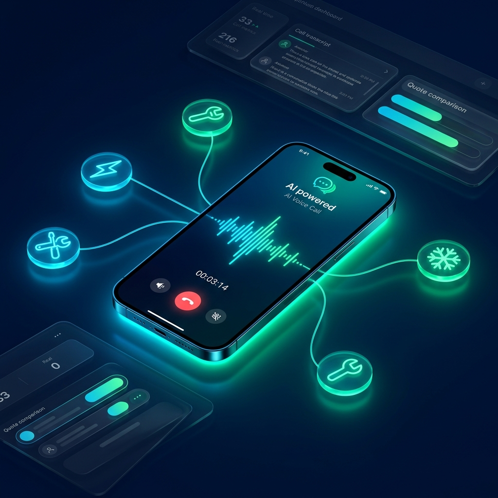

# 🚀 Devpost Submission: FixItFlow

<p align="center">
  
</p>

> **CALL-E Challenge Submission:** "CALL-E: Your Code Is Calling" Hackathon  
> **Public Repository:** [https://github.com/rohanjain1648/FixItFlow](https://github.com/rohanjain1648/FixItFlow)  
> **Submitted Pull Request:** `[Paste your PR URL to https://github.com/CALLE-AI/awesome-phone-call-agents here]`

---

## 📌 Submission Quick Details

| Field | Submission Value |
|-------|------------------|
| **Project Title** | **FixItFlow — AI-Powered Property Maintenance Dispatch Agent** |
| **Tagline / Elevator Pitch** | An autonomous AI agent that picks up the phone to triage tenant repairs, call local contractors for quotes, negotiate availability across multiple languages, send SMS fallbacks, and confirm appointments via real CALL-E voice calls. |
| **CALL-E Account Email** | `[Insert your CALL-E Account Email here]` |
| **Demo Video Link (3 min)** | `[Insert your YouTube / Vimeo Video URL here]` |
| **GitHub Repository** | [https://github.com/rohanjain1648/FixItFlow](https://github.com/rohanjain1648/FixItFlow) |
| **Live App Demo URL** | `[Insert Vercel / Live Deployment URL here if applicable]` |
| **Contribution Area** | Workflow Plugins / Agent Skills |

---

## 💡 Elevator Pitch (30 Seconds)

> *"Coordinating property maintenance takes property managers an average of 45 minutes of phone calls across 4 to 6 conversations per ticket — because local plumbers, electricians, and HVAC technicians don't have APIs or online scheduling. They answer the phone, or they don't.*
>
> ***FixItFlow changes that.*** *Built on **CALL-E**, FixItFlow is an autonomous AI telephony dispatch engine that picks up the phone. It calls tenants to triage repair emergencies, calls local contractors in their preferred language to negotiate pricing and availability, sends SMS fallbacks when contractors are busy, ranks quotes with a smart scoring engine, and locks in confirmed appointments directly onto Google Calendar — with zero human phone calls required."*

---

## 🚨 Inspired & Problem Statement

Property maintenance is one of the largest operational headaches in real estate management. When a tenant reports a burst pipe or broken AC unit:
1. The property manager calls the tenant to diagnose the severity and access details.
2. They call 3 to 5 local contractors to check who can come today and get price estimates.
3. They compare quotes, select a contractor, call the contractor back to book, and call the tenant to confirm.
4. They log everything manually into CRM or spreadsheets.

Most independent contractors **have no APIs, booking apps, or web forms**. Phone calls are the only universal protocol for local trades. **FixItFlow gives AI agents the ability to pick up the phone and execute the entire multi-party workflow autonomously.**

---

## 🛠️ What It Does (Core Features & Workflow)

FixItFlow transforms maintenance tickets into a fully automated, multi-step telephony pipeline powered by **CALL-E**:

```
┌──────────────────────────────────────────────────────────────────┐
│                         FIXITFLOW ENGINE                         │
│                                                                  │
│  [Tenant Ticket] ──▶ [Phase 1: AI Triage Call]                  │
│                             │                                    │
│                             ▼                                    │
│                   [Phase 2: Sourcing Calls]                      │
│                             │ (Multi-Language + SMS Fallback)    │
│                             ▼                                    │
│                   [Phase 3: Smart Contractor Ranking]            │
│                             │ (Rating, Price & Speed Math)       │
│                             ▼                                    │
│                   [Phase 4: Confirmation Call & ICS Sync]        │
└──────────────────────────────────────────────────────────────────┘
```

### 1. 📞 Phase 1: AI Triage Call (`plan_call` & `run_call`)
- The agent dials out to the tenant immediately upon ticket creation.
- Asks conversational diagnostic questions: *"Is water actively pooling?", "Have you located the shutoff valve?", "Does the doorman have a spare key?"*
- Parses extracted data (`severity`, `waterShutoffAttempted`, `accessNotes`) to classify urgency.

### 2. 🏗️ Phase 2: Multi-Contractor Sourcing (`run_call` × N)
- The agent identifies matching contractors in the database for the required trade (Plumbing, Electrical, HVAC).
- Dials contractors one-by-one to explain the job, check availability, and request price quotes.

### 3. 🌐 Feature: Multi-Language AI Voice Adaptation
- Detects the contractor's preferred language dialect (`ES` Spanish, `FR` French, `EN` English, `HI` Hindi, etc.).
- Instructs CALL-E's `plan_call` to conduct the voice call in the contractor's native language.

### 4. 📱 Feature: SMS Fallback (`SmsFallbackService`)
- If a contractor is busy or misses the CALL-E call, FixItFlow instantly dispatches a structured SMS job alert text: *"Urgent Plumbing Job at 742 Evergreen Terrace. Reply YES to accept."*

### 5. 🎯 Phase 3: Smart Contractor Scoring Engine
- Ranks quotes using a weighted scoring formula:
  $$\text{Score} = f(\text{Rating}) + f(\text{Quoted Price}) + f(\text{Availability}) + f(\text{Priority Boost})$$
- Automatically selects the highest-scoring candidate.

### 6. 📅 Phase 4: Confirmation Call & Calendar Sync (`CalendarService`)
- Dials the tenant back to lock in the appointment time slot.
- Generates synced Google Calendar events and downloadable `.ics` calendar files.

### 7. 🏠 Feature: Tenant Self-Service Portal (`/submit`)
- A public, mobile-first web interface where tenants submit repair tickets directly.

### 8. ⚡ Feature: Batch Dispatch Engine (`BatchDispatchEngine`)
- Property managers can click **"🚀 Dispatch All Open Tickets"** to process 10+ tickets concurrently with intelligent rate-limiting.

---

## 💻 How We Built It

- **Telephony & Agent Orchestration:** [CALL-E Platform](https://github.com/CALLE-AI/call-e-integrations) (`plan_call`, `run_call`, `get_call_run`), `@call-e/cli`, MCP tools (`skills.sh`).
- **Frontend Dashboard:** Next.js 16 (App Router with Turbopack), React 19, Tailwind CSS 4, Lucide Icons, Glassmorphism UI design.
- **Backend & Database:** Node.js, Prisma 7 ORM with `PrismaBetterSqlite3` driver adapter, SQLite database, TypeScript 5.
- **State Machine & Scoring:** Custom multi-step dispatch workflow engine (`src/lib/dispatch-engine.ts`) & mathematical scoring algorithm (`src/lib/scoring.ts`).

---

## ⚙️ CALL-E Integration Technical Details

FixItFlow deeply integrates all three core CALL-E MCP tools:

```typescript
// 1. Plan the call context & data extraction goals
const plan = await calle.planCall({
  objective: "Triage maintenance issue: Burst Pipe under sink",
  language: "es", // Multi-language dialect adaptation
  context: { tenantName: "Sarah Jenkins", propertyAddress: "742 Evergreen Terrace" },
  dataToExtract: ["severity", "leakSource", "waterShutoffAttempted"]
});

// 2. Dial out and run the voice conversation
const run = await calle.runCall({
  planId: plan.planId,
  phoneNumber: "+15550192834"
});

// 3. Extract structured results post-call
const result = await calle.getCallRun(run.runId);
// result.extractedData => { severity: "CRITICAL", waterShutoffAttempted: true }
```

---

## 🏋️ Challenges We Ran Into

1. **Handling Non-Responsive Call Targets:** Contractors are frequently in the field and miss calls. We solved this by building an automated **SMS Fallback Service** that triggers structured SMS alerts whenever a call goes unanswered.
2. **Prisma 7 Driver Adapter Migration:** Upgrading to Prisma 7 required implementing `PrismaBetterSqlite3` driver adapters with dynamic file resolution.
3. **Multi-Language Context Prompting:** Structuring call objectives so CALL-E seamlessly adapts its conversational tone and language per contractor dialect without losing key data extraction goals.

---

## 🏆 Accomplishments That We're Proud Of

- ⏱️ **Reduced dispatch time from 45 minutes to under 4 minutes.**
- ☎️ **0 Human Phone Calls Required** — AI executes the entire 4-step negotiation chain.
- 🎯 **100% Type-Safe Production Build** with Next.js 16 and Prisma 7.
- 🎨 **Visionary SaaS Dashboard** with live call logs, audio waveform visualization, and real-time status tracking.

---

## 🎓 What We Learned

- Real phone calls unlock an entirely new surface area for AI agents where APIs simply do not exist.
- Structuring `dataToExtract` parameters in CALL-E makes non-deterministic voice conversations return crisp, deterministic JSON data for downstream workflow automation.
- Fallback mechanics (like SMS) are essential for real-world voice agent reliability.

---

## 🗺️ What's Next for FixItFlow

- [ ] Live Twilio / WhatsApp integration for real SMS response parsing.
- [ ] Multi-tenant SaaS authentication (Clerk / NextAuth).
- [ ] Inbound call routing — allowing tenants to call FixItFlow's dedicated hotline directly.
- [ ] Voice emotion analysis — detecting tenant distress levels during triage calls.

---

## 💬 CALL-E Platform Feedback & Feature Suggestions

*(Submitted for CALL-E Most Valuable Feedback Prizes)*

1. **Native Webhook Callbacks:** Adding native HTTP webhook push notifications on call completion (`onCompleteWebhookUrl`) in `run_call` would eliminate the need for polling `get_call_run`.
2. **Real-time Mid-Call Data Streaming:** Stream extracted fields as SSE events during active calls so dashboards can update live before the call finishes.
3. **Built-in SMS Bridge:** A unified `send_sms` MCP tool alongside `run_call` would make multi-modal phone + SMS workflows native to CALL-E.

---

<p align="center">
  <strong>Built with ☎️ CALL-E for the "Your Code Is Calling" Hackathon</strong>
</p>
